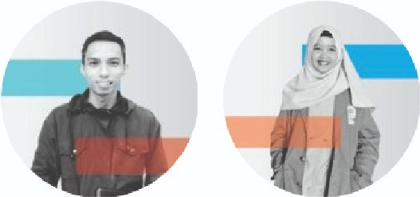

## None dan Mangan Kepri

Aplikasi merupakan perkembangan dari tugas pemograman WEB. Aplikasi ini untuk tujuan tugas akhir (UAS).<br>
Spesifikasi yang digunakan adalah :<br>

```
    Bahasa Pemograman   : PHP
    Framework           : CodeIgniter 4
    CSS                 : Materialiaze CSS dan Bootstrap
    Admin menggunakan template SB Admin 2
```

List branch :

1. <a href="https://github.com/Dendi6/None-Mangan-Kepri-PWEB-UMRAH/tree/mangan">Mangan Kepri</a>
2. <a href="https://github.com/Dendi6/None-Mangan-Kepri-PWEB-UMRAH/tree/none">None Kepri</a>

## Contributor


