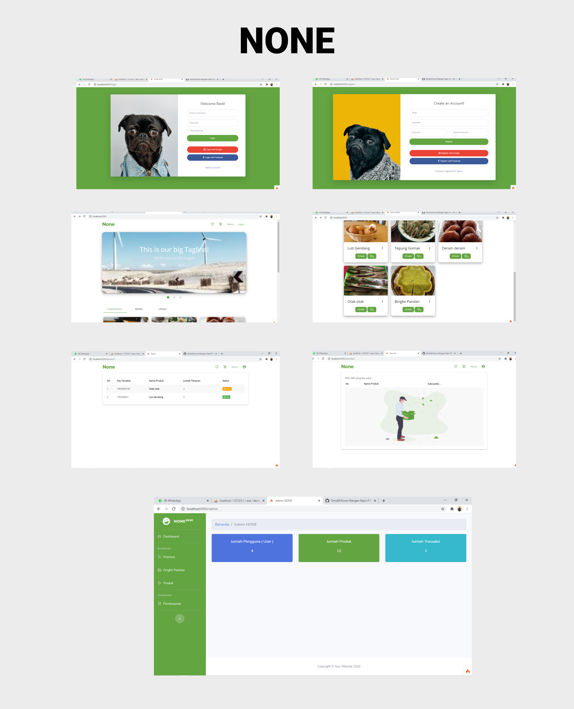
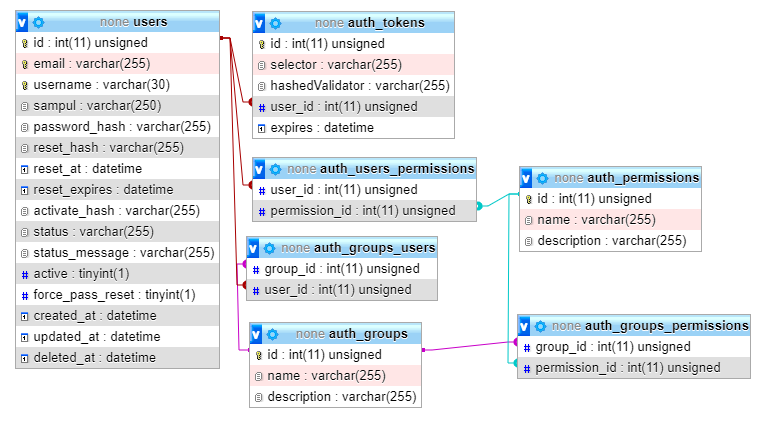
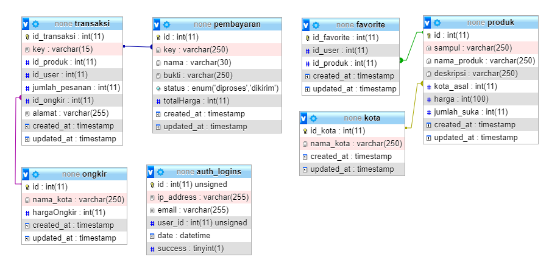

## NONE

None merupakan website yang di kembangkan demi kepentingan tugas akhir Pemograman WEB.
Tugas di buat oleh Dendi dengan nim 180155201029. Tugas di bangun menggunakan php, dan codeIgniter 4 sebagai framework. Dan SB Admin 2 sebagai template admin

NONE => OLEH OLEH Kepualauan Riau

## Running Code

1. Download kode dengan cara melakukan perintah
   > git clone https://github.com/Dendi6/None-Mangan-Kepri-PWEB-UMRAH.git
2. Import database,
3. Lakukan perintah jalankan seting coneksi, dengan cara merename `env` ke `.env`
4. Melakukan update composer
   > composer update
5. Running port dengan cara
   > php spark serve

## Interface

## Database Dokumentasi

